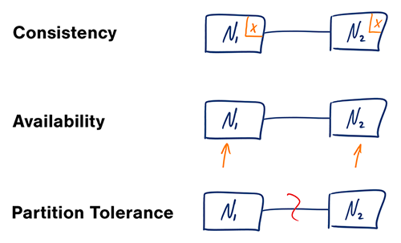
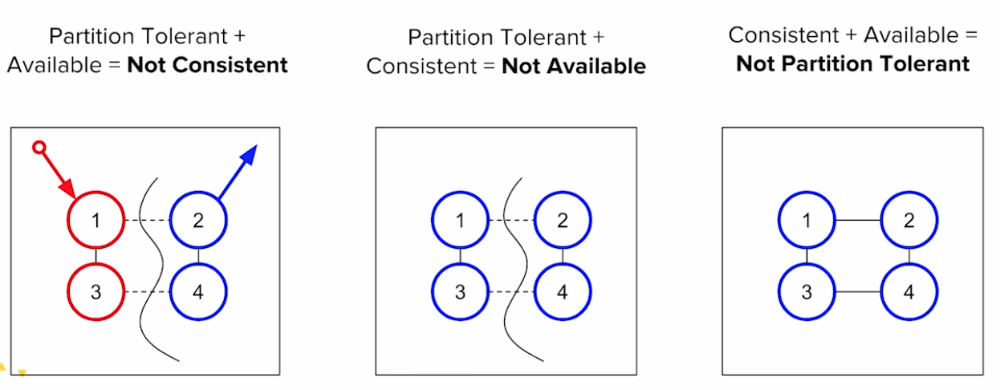
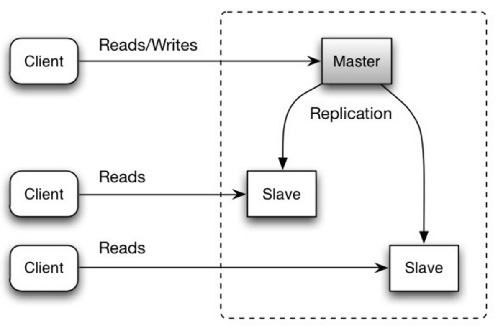
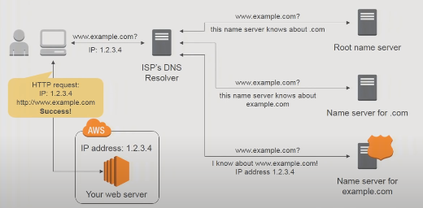

# Notes

## LeCloud Posts 

- Cloning:
    - **First golden rule for scalability: every server contains exactly the same codebase and does not store any user-related data, like sessions or profile pictures, on local disc or memory.**
    - Public servers of scalable web service are hidden behind load balancers. These load balancers distribute load(requests) from the users to different servers in a group/cluster.
    - Users should always get the same results from the web service even if it is served by different servers at different instances.
    - Sessions need to be stored in a centralised data store which has access to all the app servers. (can be an external database or a persistent storage like Redis/memcache) [if it’s on external, it has better performance] (why??)
    - One thing to ensure that your application servers don’t keep state. State should be externalized into a central data store.
    - Need to ensure that the code change within sessions has to be outsourced to all the servers serving the requests - to ensure consistency.
- Database:
    - **Even if servers can horizontally scale and we are ready to serve thousands of concurrent requests, the app gets slower and slower and breaks down. - because of DB**
    - 2 ways to tackle this issue
        - **Keep the DB as it is** - Uses master-slave replication and upgrade master by adding more RAM. Use something like “sharding”, “denormalization” and “SQL tuning” > but every such action will be more and more expensive and a time-consuming process.
        - **Denormalize data right from the beginning and include more joins in the DB query.** Keep using the same DB or any form of NoSQL DB. Use a lot more joins as early as possible. However, all such efforts will also lead to DB requests being slower. This in turn will cause a need to introduce Cache.
- Cache:
    - **Even if you have found a near-good solution to store TB’s of information on your server end; the users are still suffering from slow response because of DB overhead. Hence. There is a need for “Cache”**
    - Cache - in-memory caches like Memcached or Redis. File-based caching is not preferred because it creates unnecessary pain while scaling and cloning of servers.
    - A cache is a simple key-value store and it should reside as a buffering layer between your application and your data storage. Whenever your application has to read data it should at first try to retrieve the data from your cache. Only if it’s not in the cache should it then try to get the data from the main data source.
    - 2 patterns of caching data
        - **Cached Objects** - See data as objects. Let class assemble the dataset from the DB and then store complete instances of class/dataset in the cache. When the class has finished the “assembling” of the data array, directly store the data array, or better yet the complete instance of the class, in the cache! This results in easily getting rid of the object whenever something does change and makes the overall operation of code faster and more logical. It is an async operation. The app consumes the latest cached object and never touches the DB anymore.
        - **Cached DB queries** - Query to DB -> store the returned results in cache. A cache is moreover a form of key-value pair Data structure. So, the hashed version of the query is the cache key. So next time, whenever we fire the same query on the app server; the first check is made whether the hashed version of the query exists in the cache; if it does, it is returned, else, we reach out to the main DB from where the results are returned and stored in the cache and then served to the user.
            - Issue - Expiration. Hard to delete the cached result if we cache a complex query. [ When one piece of data changes (for example a table cell) you need to delete all cached queries that may include that table cell.]
- Async: (Bakery example…)
    - 2 Async paradigms -
        - Doing time-consuming work in advance and serving the completed work with low request time. Example - turn dynamic content to static.
        - Handling “new” tasks asynchronously - A user comes to your website and starts a very computing-intensive task that would take several minutes to finish. So the frontend of your website sends a job onto a job queue and immediately signals back to the user: your job is at work, please continue to browse the page. The job queue is constantly checked by a bunch of workers for new jobs. If there is a new job then the worker does the job and after some minutes sends a signal that the job was done. The frontend, which constantly checks for a new “job is done” - signals, sees that the job was done and informs the user about it.

- [Find more on LeCloud Blog](https://www.lecloud.net/tagged/scalability)  

## David Malan's Scalability Video 

- Web Hosts:
    - Features-
        - Is IP address blocked in some countries/regions?
        - SFTP vs. FTP - SFTP is secure and all the traffic is encrypted, which is important for usernames and passwords
        - Some hosting companies may offer you some unbelievable features, like unlimited storage space, at a very low price. It’s very likely that you and another hundreds users are sharing the same machine and contending for resources. This is because sometimes people actually don’t need that many resources. (Classic example of “Hathway wifi” in India. [50mbps speed on paper but the max speed ever achieved was 8mbps])
        - Virtual private server. May still share one machine with other users, but you have your own copy of the operating system. Run multiple virtual machines on a physical machine. Only you and the system administrators have access to your files
        - If you want more privacy, then probably you have to operate your own servers
- **How to scale to handle more users (Website all of sudden gets super popular.):**
    - **Vertical Scaling** [Scaling on a single machine] [more and more computational resources on single hardware]
        - When you are exhausted with your CPU processor, ram, disk space orGet more RAM, processors, disks,…, for one machine, you will exhaust the financial resources/state of arts technology.
    - **Horizontal Scaling**
        - There is a ceiling on resources per hardware, so accept this fact and stay below it by not even using the state of art hardware, but cheaper hardware.
        - Plural number of machines, use multiple servers to build the topology.
    - **Load Balancer (Man in the middle)**
        - Need to distribute inbound HTTP requests.
        - Return the public IP address of the load balancer, and let the load balancer determine how to actually route data to the backend server (private address).
        - **Implementation**
            - Dedicated servers for gifs, jpegs, images, videos, etc for different host HTTP header
            - Round robin. Or, the load balancer can be a DNS setup which returns the IP address of server 1 when the first time someone asks for a url, then return the IP address of server 2 when the second time someone asks for the same url, then server 3, server 4,…, eventually wrapping up. Downside: one server may get a really computational heavy user; (BIND DNS server => returns different IP address for each request )
            - Based on the load on a server (least busy server gets request)
            - Have a server specifically for storing sessions. But what if that machine breaks down. Lacks redundancy. Can add RAID (redundant array of independent disks), striping and redundancy [?? read some blog on revising different types of RAID and their implications]
        - When we type the url in the browser and hit enter, the OS will send a packet to the DNS server which will translate hostnames to IPs and vice versa. If we click a link on a website, there is a cache to store the IP address so the OS doesn’t have to send the same DNS request again. Both OS and browser have a cache. Time to Live (TTL) values associated with an answer from a DNS server, 5 minutes, 1 hour, or 1 day. Global load balancing…
        - If the backend is PHP based and the session in PHP is broken. And if you were on Server 1, then by chance you are sent to Server 2 by a round-robin, you might have to log in again. Or think about shopping carts.
        - **Shared storage flavours** - Fibre storage, iSCSI, MySQL
        - **Stick sessions** - when you visit a website multiple times your session is somehow preserve even if there are multiple backend servers
        - **Cookies** - Can store the address of the server so the next the user visits the website, he goes to the same back-end server. Downside: the private IP of the back-end server may change; the private IP is now visible to the whole world.
        - Store a random number and let the load balancer remember which number belongs to which server.
            - Software - ELB, HAProxy, LVS
            - Hardware - Barracuda, Cisco, Citrix, F5
        - PHP Acceleration - php.exe compiles PHP every time but throws away the result. Some software can keep the result. Like .py vs. .pyc.
    - **Caching**
        - .html vs. MySQL database/XML (avoid regenerating) more performance vs. more space. But requires a lot of work when want to update/redesign the page
        - MySQL query cache: query_cache_type: 1
        - memcached: store whatever you want in RAM (garbage collection: expire objects based on when they are put in)
    - **Replication:**
        - Master-Slave
            - Master: the main database that you write/read data to/from.
            - Slave: anytime a query is executed on the master that same query is copied down to one or more slaves and they do the exact same thing
            - Advantages:
                - If the master is down, promote one of the slaves and do some configuration. (redundancy)
                - If there are a lot queries, you could just load balance across database servers
                - For read heavy websites, any select can go to all four databases, while any insert/update/delete has to go to server master
        - Master-Master: You could write to either server one or two and if you happen to write to server1 that query gets replicated on server2 and vice versa so now you could keep it simple
    - **Load balancing + Replication:**
        - active - active pair of load balancers
        - active - passive pair of load balancers, passive promotes itself when receives no more packets from the active one. and send packets to each other
    - **Partitioning:** A-M cluster and O-Z cluster
    - **High Availability:** One load balancer, two master replicating each other  

- [CS75 Video](https://www.youtube.com/watch?v=-W9F__D3oY4)

## Performance vs Scalability 

- **Everything is a tradeoff**
- Any service is scalable if it results in increased performance proportional to the resources added. (As we increase resources, the performance has to increase).
- **Performance merely means serving more units of work or it can also mean handling larger units of work when datasets grow**
- If your system is low on performance; it means your system is slow for a single user.
- If you cannot scale up your system; it means your system is fast for single users but fails to respond/gets slow under heavy load/traffic/concurrent requests.

## CAP Theorem And CA Patterns
- You can only have two out of the following three guarantees across a write/read pair: Consistency, Availability, and Partition Tolerance - one of them must be a sacrifice
    - *Consistency - Read is guaranteed to return the most recent write.*
    - *Availability - Non-failing nodes will return a reasonable response within a reasonable amount of time.*
    - *Partition Tolerance - The system functions normally when a partition occurs.*
    
    

- According to the [Fallacy of Distributed computing](https://en.wikipedia.org/wiki/Fallacies_of_distributed_computing), networks aren’t reliable. Hence we must tolerate partitions in the network. So we are left with only ⅔ options that are consistent and available.
- **Choose either among the following -**
    - CP - consistency and partition tolerance - Waiting for a response from the partitioned node might result in a timeout error. ***CP is a good choice if your business requires atomic reads and writes.***
    - AP - availability, and partition - Responses return the most readily available version of the data available on any node, which might not be the latest. Writes might take some time to propagate when the partition is resolved. ***AP is a good choice if the business needs allow for eventual consistency or when the system needs to continue working despite external errors.***
- **Proof of CAP -**
    - **Case 1: P + A = NC:** Example of a Berkeley student getting admitted into Stanford. Now there are four systems 1,2,3,4 and user queries to system 2 which in turn returns blue however the current state is red. Hence, the system is not consistent even if it’s available and partition tolerant.
    - **Case 2: P + C = NA:** Here, if the network is partitioned, systems 2 and 4 are not available. So if the update to red at system 2 is made, this update when it tries to propagate to node 2 and 4; the network doesn’t receive any response. This in turn proves that the system is not active. Hence not available.
    - **Case 3: A + C = NP:** When there are no partitions, everything works fine. Updates are possible and the network is consistent. But now, the problem is when a partition is thrown, the systems fall in either Case 1/Case 2.

        

- [Very good intro proof to CAP theorem](https://mwhittaker.github.io/blog/an_illustrated_proof_of_the_cap_theorem/)

- **Consistency patterns**
    - **Weak consistency:** After a write, the reads may or may not see it. Weak consistency works well VoIP, video chat, realtime multiplayer games. Eg - memcached
    - **Eventual consistency:** After a write, the reads will eventually see it. Data is replicated asynchronously. Eg - DNS, email
    - **Strong consistency:** After a write, read will see it. Data is replicated synchronously. Works well in transaction based systems and RDBMSes.
    - Talk - [Transactions across data centers](https://www.youtube.com/watch?v=srOgpXECblk)
    - [Many more consistency models can be found here](https://en.wikipedia.org/wiki/Consistency_model)
- **Availability patterns**
    - Failover
        - **Active-active:** Both servers are managing traffic, spreading the load between them. If the servers are public-facing, the DNS would need to know about the public IPs of both servers. If the servers are internal-facing, application logic would need to know about both servers.
        - **Active-passive:** With active-passive fail-over, heartbeats are sent between the active and the passive server on standby. If the heartbeat is interrupted, the passive server takes over the active's IP address and resumes service. The length of downtime is determined by whether the passive server is already running in 'hot' standby or whether it needs to start up from 'cold' standby. Only the active server handles traffic.
    - Partition
        - **Master-slave replication:** The master serves to read and write requests, replicating writes to all the slaves. The slaves can send the information to child slaves in a tree-like fashion. The slaves are only used for serving the read requests. When the master server is down, the system can operate in read-only mode until a slave is promoted as a master or a new master is set up. Consistency is not too difficult because each piece of data has exactly one owning master. But then what do you do if you can't see that master, some kind of postponed work is needed.

            

        - **Master-master replication:** Both the masters serve to read and write. If either master goes down, the system can continue with reads and writes. If you can make multi-master work then it seems to offer everything, no single point of failure, everyone can work all the time. The trouble with this is that it is very hard to preserve absolute consistency.

            

- Availability decreases when both the components having availability < 100% are connected in series. Whereas if they are connected in parallel the cumulative availability increases.
- For components in series: Total availability = availability(A) * availability(B)
- For components in parallel: Total availability = 1 - (1 - Availability (A)) * (1 - Availability (B))

- [Scalability, availability and stability patterns](https://www.slideshare.net/jboner/scalability-availability-stability-patterns)
  
## DNS

- **Domain name ⇒ IP Address mapping.**
- A hierarchical system with authoritative servers at the top level. Router/isp provides information about which DNS server to reach out to for lookup. Lower level DNS mappings become stale due to DNS propagation delays. DNS results can also be cached which is determined by Time to live (TTL)
    - **NS record (name server)** - Specifies the DNS servers for your domain/subdomain.
    - **MX record (mail exchange)** - Specifies the mail servers for accepting messages.
    - **A record (address)** - Points a name to an IP address.
    - **CNAME (canonical)** - Points a name to another name or `CNAME` (example.com to [www.example.com](http://www.example.com/)) or to an `A` record.
- Routing traffic through different mechanisms -
    - Weighted Round Robin - Focuses on fairly distributing the load and not equally distributing the load. It maintains a balance between varying cluster sizes.
    - Latency-based - If the application is hosted in multiple regions, we can provide users with the quickest response time based on the region that provides the lowest latency.
    - Geolocation-based - Geolocation routing lets you choose the resources that serve your traffic based on the geographic location of your users.
- **Disadvatanges -**
    - Accessing a DNS server introduces slight delay. (Can be mitigated by caching)
    - DNS server management is complex.

## CDN

- Distributed network of proxy servers serving content to users from locations closer to them.
- Generally CDN's serve static files. Although, some CDN's(Amazon CloudFrount) supports dynamic content.
- Helps speeding up static components of a website by distributing them across a number of servers around the world.
- **Advantages -**
    - Users receive content from data centers close to them.
    - Servers don't serve requests which the CDN fulfills.
- **Push Based CDN's** -
    - You are solely responsible for pushing **new content to CDN** when changes occur on the server. You are responsible for providing new content, rewriting URLs to point to new changes made on CDN. Also, you are responsible for configuring when the content expires and when it is updated. The content is only updated when changes happen on the server. This minimizes traffic but maximizes storage.
    - Websites having less traffic / less frequent changes work well with Push CDN. Entire content is placed on the CDN once instead of being repulled again and again.
- **Pull Based CDN's -**
    - They grad content from the server when the first user requests content. The content resides on your server and we rewrite URLs to point to the CDN. ⇒ Results in a slower request until caching is exercised on the CDN.
    - TTL determines how long content is cached. They minimize storage space on CDN but they are vulnerable to redundant traffic. (If TTL expires and the files are pulled before they have actually changed)
    - Websites having heavy traffic / more frequently requested content changes work well with Pull CDN. Only the recently-requested content is placed on the CDN.
- **Disadvantages -**
    - CDN costs are directly proportional to traffic that you receive.
    - Content can become stale if there is an update before TTL expiry.
- [Difference between Pull and Push CDN](http://www.travelblogadvice.com/technical/the-differences-between-push-and-pull-cdns/)

## Load Balancer

- Distributed incoming requests to different servers/computing resources. Load balancers are useful in preventing requests from going to unhealthy servers, preventing overloading resources, and helping eliminate the single point of failure. Additional benefits are SSL termination and session persistence.
- **Different algorithms based on different metrics for routing traffic requests -**
    - **Layer 4** -
        - They look for information/packet at the transport layer of the TCP/IP stack to determine how to distribute requests.
        - They can understand source + destination IP address, ports, but not the content of the packet.
        - For the source, the destination IP address is the load balancer's address in this case. And when the load balancer receives this IP address, it performs Network Address Translation(NAT) and changes the destination IP address to address of content server. Similarly while sending the response back to client the load balancer performs a NAT and changes destination IP address to that of source IP address.
        - The layer 4 load balancer is usually a dedicated hardware device supplied by a vendor and runs proprietary load balancing software. Also, the NAT operations are performed by chips instead of the software.
        - Uses raw TCP for sending packets.
    - **Layer 7 (reverse proxy)** -
        - They look at the application layer to decide how to distribute requests. This involves the message, contents of the header, and cookies.
        - They terminate network traffic, read messages, perform load-balancing by opening connections to a server.
        - Load balancing at layer 7 is more CPU intensive. It uses buffering to offload slow connections from upstream servers which improve performance.
        - It routes traffic in a much more sophisticated manner particularly applicable to TCP-based traffic such as HTTP.
    - **Round Robin/Weighted Round Robin** - Uses a round-robin algorithm where you go by a fixed turn to each server and keep distributing requests to them. Weighted Round Robin works in an efficient manner by assigning weights(depending on the server capacity) to each server and then distributing the load respectively.
    - Session/Cookies
    - Random
    - Least loaded
- **Disadvantages -**
    - Can become a bottleneck if it doesn't have enough resources or if its misconfigured.
    - More complexity.
    - Single load balancer is single point of failure, including multiple backup or master load balancers further increases complexity.
- **[Nginx Architecture](https://www.nginx.com/blog/inside-nginx-how-we-designed-for-performance-scale/)**
- **Layer 4 vs Layer 7 load balancing**

    

- [Configuring listeners for load balancers](http://docs.aws.amazon.com/elasticloadbalancing/latest/classic/elb-listener-config.html)

## Reverse Proxy

- Web server that focuses on providing unified interface to the outside world and centralizes the internal services.
- When a client requests for data, he is exposed to common public IP address that belongs to the reverse proxy. The actual backend IP address of different servers are not being exposed. This results in better security on the backend servers. While returning a response to user from the client, the reverse proxy changes the source IP address from server's address to its IP address. This creates a proxy layer in front of actual backend servers that exist. Hence its called a reverse proxy.
- Benefits of Reverse Proxy -
    - Increased security - Hide information about backend servers, blacklist IPs, limit number of connections per client
    - Increased scalability and flexibility - Clients only see the reverse proxy's IP, allowing you to scale servers or change their configuration
    - SSL termination - Decrypt incoming requests and encrypt server responses so backend servers do not have to perform these potentially expensive operations
    - Removes the need to install X.509 certificates on each server
    - Compression - Compress server responses
    - Caching - Return the response for cached requests
    - Static content - Serve static content directly
- **Disadvantages -**
    - More complexity.
    - Single reverse proxy - Single point of failure
- Load balancer vs Reverse proxy -
    - Load balancer is designed to route traffic to different servers whereas reverse proxy works as a camouflaging layer to not expose the actual backend servers.